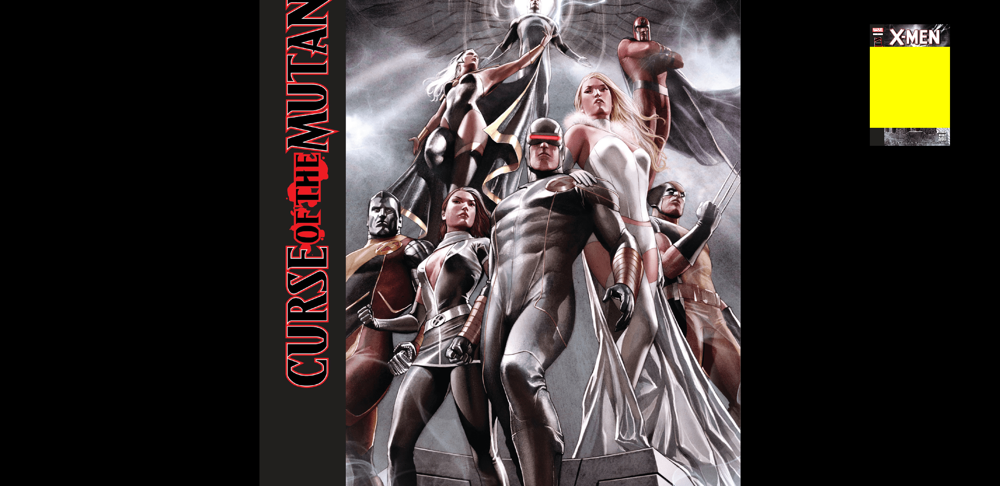
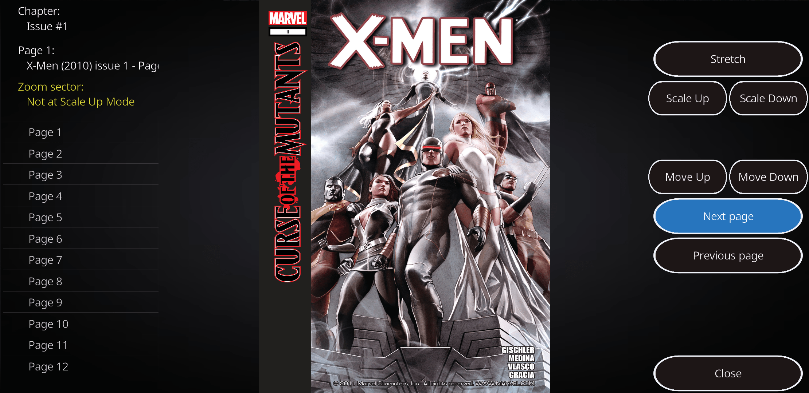

# K-Viewer

Comics and Mangas Viewer for Kodi

---

## Controls for Default Viewer

**Keyboard**

- `0`: default zoom (100%)
- `1-9`: zoom level 1-9
- `r`: rotate
- `o`: codec info
- `. (period)`: next image
- `, (comma)`: previous image
- `+ (plus)`: zoom in
- `- (minus)`: zoom out
- `← (backspace)`: quit image viewer
- `p`: play slideshow mode
- `space`: pause slideshow mode
- `x`: quit image viewer

**Touchscreen**

- `slide up/down`: rotate image to right/left
- `slide right/left`: previous/next image
- `pinch/spread`: zoom control
- `hold`: quit image viewer

---

## Controls for Custom GUI Viewer

The current built-in image viewer in Kodi suffers from an issue where it attempts to read all images in a directory before presenting them.

This can be extremely time consuming depending on the directory size.

The custom GUI based at [PyXBMCt](https://github.com/romanvm/script.module.pyxbmct) and [PIL](https://github.com/mrdominuzq/script.module.pil) / [Pillow](https://github.com/python-pillow/Pillow) improves this by loading only one image at time.

For systems where PIL is not usable due [know issues](https://github.com/xbmc/xbmc/issues/21531) (android x86 for example), `Scale Up` function will not be able to `Move Up` or `Move Down`.

**Keyboard**

- `0`: quit image viewer
- `1`: stretch image mode
- `2`: scale up image mode
- `3`: scale down image mode
- `4`: previous image
- `5`: next image
- `6`: move scaled image up
- `7`: nothing
- `8`: nothing
- `9`: move scaled image down
- Use buttons and list controls

**Touchscreen**

- Use buttons and list controls

---

## Changelog

**0.2**

- optional viewer with custom GUI

**0.1**

- initial version
